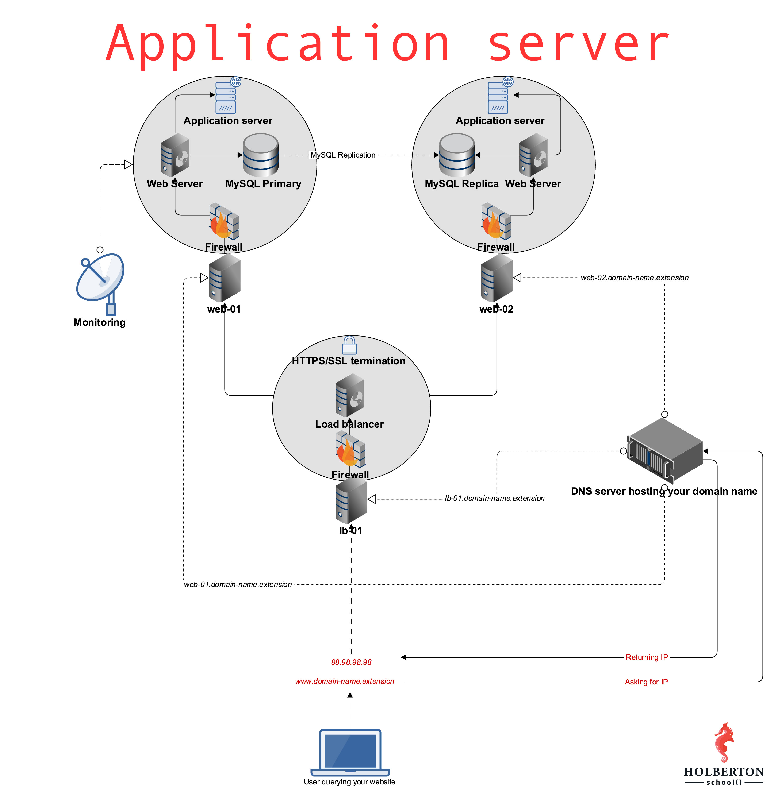

# 0x1A - Application Server 🚀



Welcome to the **0x1A - Application Server** project! In this project, we'll dive deep into deploying web applications using an application server instead of relying solely on the web server. We'll configure our setup to serve dynamic content while keeping things scalable and efficient! 🌐💻

## Table of Contents 📚

- [Introduction](#introduction)
- [Technologies Used](#technologies-used)
- [Setup Guide](#setup-guide)
- [Usage](#usage)
- [Author](#author)

## Introduction 📝

In this project, we will:
- Deploy an application server to manage dynamic content 🛠️
- Configure a reverse proxy with Nginx to forward requests to the app server 🌐
- Explore concepts of load balancing, process management, and server configuration ⚙️

By the end, you'll have a fully functional application served by a web server (Nginx) and an application server (Gunicorn or uWSGI).

## Technologies Used 🛠️

- **Nginx** - Web server and reverse proxy server 🚦
- **Gunicorn/uWSGI** - Application servers to manage our web apps 🐍
- **Flask/Django** - Python web framework for dynamic content 📱
- **Ubuntu 20.04 LTS** - The OS for deployment 🐧

## Setup Guide 🛠️

Follow these steps to set up your environment:

1. **Install Nginx** 🕸️:
   ```bash
   sudo apt update
   sudo apt install nginx

2. **Install Gunicorn** 🔥:
   ```bash
   pip install gunicorn
   ```

3. **Configure Nginx**:
   - Update `/etc/nginx/sites-available/default` to configure your reverse proxy to forward traffic to the application server 🚦.

4. **Test your application** 🚀:
   - Run your Python web application with Gunicorn:
   ```bash
   gunicorn --bind 0.0.0.0:5000 wsgi:app
   ```

5. **Check the Nginx configuration**:
   - Restart Nginx:
   ```bash
   sudo service nginx restart
   ```

## Usage 💡

- To start the application server, run:
  ```bash
  gunicorn --bind 0.0.0.0:5000 wsgi:app
  ```

- Navigate to `http://<your-server-ip>/` to view your deployed app! 🌐

## Author 👤

- **Asive Bekezulu** - [GitHub](https://github.com/baebischops) 💻

Feel free to explore, contribute, and share your thoughts! 🎉